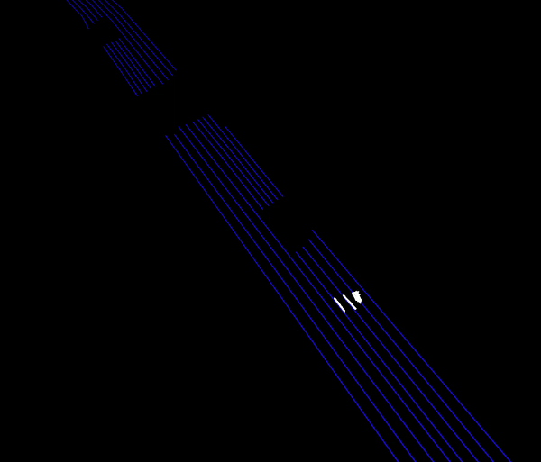
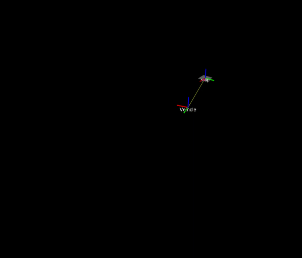

# 可视化模块

## 目录

- [rviz_project_line_to_hdmap](#rviz_project_line_to_hdmap)

  把车道线检测结果动态投影到HDMap上

- [tftree_veihcle2world](#tftree_veihcle2world)

  读取车辆GPS信息, 用tf树, 实现车辆与世界坐标系的动态变化

- [hdmap_pub](#hdmap_pub)

  把HDMap作为一个ROS节点发布, 从而达到实时更新的可视化效果

## rviz_project_line_to_hdmap

### 功能

把车道线检测结果动态投影到HDMap上

### 效果

蓝色为HDMap车道线, 白色点云为车道线检测结果



### 运行

中间忽略一些的基本操作

1. 把本功能包放到工作空间中编译

2. `rosrun rviz_project_line_to_hdmap demo.py`
3. 打开rviz, 注意需要调整下点云大小, 从而达到最好的可视化效果

## tftree_veihcle2world

### 功能

读取车辆GPS信息, 用tf树, 实现车辆与世界坐标系的动态变化

### 效果



### 运行

编译这个package

rosrun gps_folw auto_follow.py

打开rviz

## hdmap_pub

### 功能

把HDMap作为一个ROS节点发布, 从而达到实时更新的可视化效果

### 效果

小四边形为路面标识, 长四边形为人行横道, 绿色为红绿灯, 白线为车道线


### 运行

内含两个package,  hd_map实现python读取HDMap并发布；hdmap_viewer为C++, 实现PCL实时更新可视化

```
rosrun hdmap_pub map_pub.py
rosrun hdmap_viewer hdmap_viewer
```

## test_pcl

pcl可视化案例
